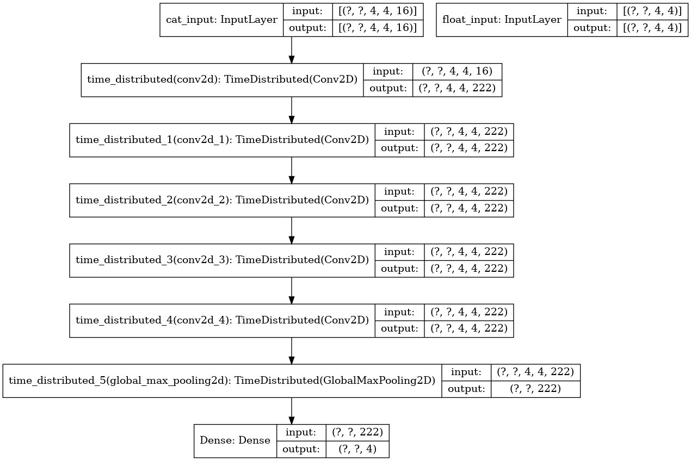

# 2048-api
A 2048 game api for training supervised learning (imitation learning) or reinforcement learning agents

# Code structure
* [`game2048/`](game2048/): the main package.
    * [`game.py`](game2048/game.py): the core 2048 `Game` class.
    * [`agents.py`](game2048/agents.py): the `Agent` class with instances.
    * [`NNagent_5_maxpool.py`](game2048/NNagent_5_maxpool.py): DCNNAgent class.
    * [`displays.py`](game2048/displays.py): the `Display` class with instances, to show the `Game` state.
    * [`expectimax/`](game2048/expectimax): a powerful ExpectiMax agent by [here](https://github.com/nneonneo/2048-ai).
* [`explore.ipynb`](explore.ipynb): introduce how to use the `Agent`, `Display` and `Game`.
* [`Myworkflow_max_pool.ipynb`](Myworkflow_max_pool.ipynb): Entire workflow to train and test the model.
* [`static/`](static/): frontend assets (based on Vue.js) for web app.
* [`webapp.py`](webapp.py): run the web app (backend) demo.
* [`evaluate.py`](evaluate.py): evaluate self-defined DCNN agent.
* [`multiplerun`](multiplerun): a bash script to run evaluate.py multiple times and redirect their outputs to different files.

# DCNN structure
The structure is based on `N. Kondo and K. Matsuzaki, "Playing game 2048 with deep convolutional neural networks trained by supervised learning", J. Inf. Process., vol. 27, pp. 340-347, 2019`. With slight adjustment to replace the final flatten layer with a globalmaxpooling2d layer. The change reduces number of parameters, but has no significant impact on the performance of the network, which may indicate the features generalized in the final CNN layer contains no information in their location.
Other attempt includes RNN(following pooling layer), globalaveragepooling, CNN with fewer layes but with more feature per layer. They do not brings better result in reaching stable 2048 (although some can more often reach 4096, they also produce more 1024). To make RNN possible, the format of input is time dependent, says BATCH_SIZE*TIMESTEPS*FEATURES. CNN layers are also forced to be wrapped in TimeDistributed layers.

Each CNN layer are homogeneous, with 222 channels, relu activation, bias enabled and padding='same'.
The final dense layers uses softmax activation with bias.
The structure allows two input, cat_input is one-hot coded game board with empty to 0, 2 to 1, 4 to 2 ,..., 32768 to 15. float_input takes uncategorized input but is currently not in use. Output is 4 numbers corresponding to 4 directions.

# Training Data
Training data include:
* [`0_1000`] First through 1000th move instructed completely by Expectimax from 50k game.
* [`1000_2000`] 1001th through 2000th move instructed completely by Expectimax from 50k game, the initial state exactly corresponds to the end state in `0_1000`.
* [`0_1000_learned`] First through 1000th move, with 0.1 chance the game actually steps according to a pretrained model with four CNN layers, in order that the network can learn recovering from sub-optimal game state. The recorded move is all given by Expectimax. 15k games are included.
* [`1000_2000_expecti2ndmove`] 1001th through 2000th move instructed by Expectimax, with 0.02 chance the game steps according to the second best move indicated by expectimax agent (expectimax agent is slight modified to also return the score for 4 directions), the initial state exactly corresponds to the end state in `0_1000`. 5k games are included.
* [`forever`] Entire game instructed by Expectimax until the game ends. 4k games are played which generated about 24 million moves. This also provides some insights into the performance of Expectimax. Most games end at around 5000 steps, with max tile of 8192. The record best game lasts 10941 moves, the record worst game lasts only 316 moves with max tile 512.

All data add up to around 144 million game states. Data generation took 2 weeks locally on my desktop PC bought in 2015.

# Training Stage
As is proposed by the article, training stage has taken advantage of the symmetry of 2048 game, where for one game state and corresponding move given by Expectimax, the game board rotated 0,90,180,270 degrees and the game board flipped against columns were all fed into the network. So in principle each game state can be used 8 times.
In the beginning I trained on my GTX1070, soon it turned out to be underpowered so I got myself a RTX2070. Training on all data takes ~12h to complete.

# Playing Stage
The agent can play with 2 styles control by vote=True or False. With vote is False, the game board is one-hot encoded then predicted with the network to generate possibilities for four moves, the move with greatest possibility is preferred. With vote is True, as is proposed by the article, the game board is expanded into 8 game boards according to symmetry and 8 prediction results are given by the network, each with possibilities for four moves. 8 prediction results first generate 8 preferred directions. If a single preferred direction cannot be specified, the sum of probability is calculated for each direction and the one with the highest sum is selected.


# Requirements
* code only tested on linux system (ubuntu 20.04 with RTX2070 driver 440)
* Python 3 (Anaconda 4.8.3 specifically) with numpy


# To compile the pre-defined ExpectiMax agent

```bash
cd game2048/expectimax
bash configure
make
```

# To watch the DCNN Agent play
```python
from game2048.game import Game
from game2048.NNagent_5_maxpool import NNAgent
from game2048.displays import Display
SCORE_TO_WIN=2048
game = Game(size=4, score_to_win=SCORE_TO_WIN) #only works for size=4 game
agent=NNAgent(game,display=Display(),debug=False,vote=True,modelname='2048_6_18_CNN5_maxpool_whatever_data_I_have')
#you can directly access the model with agent.model
agent.play(verbose=True)
```


# LICENSE
The code is under Apache-2.0 License.

# For EE369 students from SJTU only
Please read course project [requirements](EE369.md) and [description](Project2048.pdf). 
